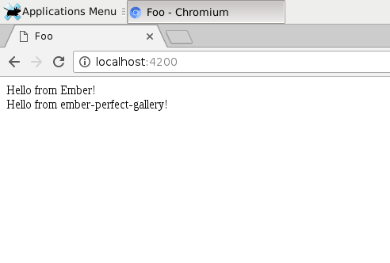
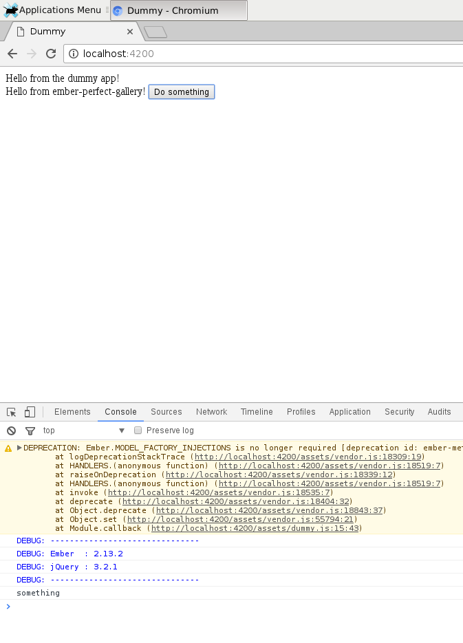
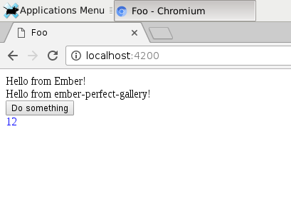

Create the add-on package:<br>
TODO: <https://github.com/ember-cli/ember-cli.github.io/issues/144><br>
`sudo ember addon perfect-gallery`

Install dependencies:<br>
`npm install perfect-layout --save`

Create a component:<br>
`ember g component ember-perfect-gallery`

Add some text to the template and test if we can import the addon to an existing ember app.

`ember new foo && cd foo`<br>
`ember install https://github.com/myartsev/ember-perfect-gallery.git`

TODO: what does this mean?

```
NPM: Installed https://github.com/myartsev/ember-perfect-gallery.git
WARNING: Could not figure out blueprint name from: "https://github.com/myartsev/ember-perfect-gallery.git". Please install the addon blueprint via "ember generate <addon-name>" if necessary.
Installed addon package.
```

# Serve the newly generated project

`ember s`

TODO: what does this mean?

```
Addon templates were detected, but there are no template compilers registered for `ember-perfect-gallery`. Please make sure your template precompiler (commonly `ember-cli-htmlbars`) is listed in `dependencies` (NOT `devDependencies`) in `ember-perfect-gallery`'s `package.json`.
```

# Try again

`ember install https://github.com/myartsev/ember-perfect-gallery.git`<br>
`ember s`

It runs! Let's try to see if we can use the addon to see our placeholder text from earlier.<br>
**application.hbs**

```
<div>Hello from Ember!</div>
{{ember-perfect-gallery}}
{{outlet}}
```

It works!<br>


# Let's try adding some interactivity.

**ember-perfect-gallery.hbs**

```
Hello from ember-perfect-gallery!
<button {{action 'doSomething'}}>Do something</button>
```

**ember-perfect-gallery.js**

```
import Ember from 'ember';
export { default } from 'ember-perfect-gallery/components/ember-perfect-gallery';

export default Ember.Component.extend({
  actions: {
    doSomething: () => {
      console.log('something');
    }
  }
});
```

Give it a try in the Ember app:<br>
`ember install https://github.com/myartsev/ember-perfect-gallery.git` Stop and restart the Ember server:<br>
`ember s`

Nope...

```
Build error

SyntaxError: foo/components/ember-perfect-gallery.js: Only one default export allowed per module. (4:0)
  2 | export { default } from 'ember-perfect-gallery/components/ember-perfect-gallery';
  3 |
> 4 | export default Ember.Component.extend({
    | ^
  5 |   actions: {
  6 |     doSomething: () => {
  7 |       console.log('something');
    at Parser.pp$5.raise (/home/anijap/code/foo/node_modules/babylon/lib/index.js:4452:13)
    at Parser.pp$1.raiseDuplicateExportError (/home/anijap/code/foo/node_modules/babylon/lib/index.js:2819:8)
    at Parser.pp$1.checkDuplicateExports (/home/anijap/code/foo/node_modules/babylon/lib/index.js:2813:10)
    at Parser.pp$1.checkExport (/home/anijap/code/foo/node_modules/babylon/lib/index.js:2712:12)
    at Parser.pp$1.parseExport (/home/anijap/code/foo/node_modules/babylon/lib/index.js:2649:10)
    at Parser.pp$1.parseStatement (/home/anijap/code/foo/node_modules/babylon/lib/index.js:1884:74)
    at Parser.pp$1.parseBlockBody (/home/anijap/code/foo/node_modules/babylon/lib/index.js:2268:21)
    at Parser.pp$1.parseTopLevel (/home/anijap/code/foo/node_modules/babylon/lib/index.js:1778:8)
    at Parser.parse (/home/anijap/code/foo/node_modules/babylon/lib/index.js:1673:17)
    at parse (/home/anijap/code/foo/node_modules/babylon/lib/index.js:7180:37)

The broccoli plugin was instantiated at:
    at Babel.Plugin (/home/anijap/code/foo/node_modules/broccoli-plugin/index.js:7:31)
    at Babel.Filter [as constructor] (/home/anijap/code/foo/node_modules/broccoli-persistent-filter/index.js:62:10)
    at new Babel (/home/anijap/code/foo/node_modules/broccoli-babel-transpiler/index.js:35:10)
    at Babel (/home/anijap/code/foo/node_modules/broccoli-babel-transpiler/index.js:30:12)
    at Class.transpileTree (/home/anijap/code/foo/node_modules/ember-cli-babel/index.js:38:48)
    at Object.toTree (/home/anijap/code/foo/node_modules/ember-cli-babel/index.js:45:30)
    at /home/anijap/code/foo/node_modules/ember-cli-preprocess-registry/preprocessors.js:180:26
    at Array.forEach (native)
    at processPlugins (/home/anijap/code/foo/node_modules/ember-cli-preprocess-registry/preprocessors.js:178:11)
    at module.exports.preprocessJs (/home/anijap/code/foo/node_modules/ember-cli-preprocess-registry/preprocessors.js:171:10)
```

Wait a minute, I can do this from the addon itself instead of having to push to GIT and test in a different Ember project. Just use the dummy app in the addon!

Turns out that there are two components in the addon hierarcy, not sure why yet. But now the JS action is working when the code is moved to _addon/components_<br>
<br>
**TODO:** what's up with the deprecation warning?<br>
**TODO:** why are there two component JS files? Is it because of the ember g command we ran earlier? 

Cool, now it works in the dummy app. Let's try with our _foo_ Ember app to make sure.<br>
`ember install https://github.com/myartsev/ember-perfect-gallery.git && ember s`<br>
All good!

# Let's try adding some styles

There doesn't appear to be a generator for adding styles.<br>
`mkdir addon/styles`

Create an app.css file here:

```
#counter {
  color: blue;
}
```

This must be added manually to be part of the addon.<br>
**index.js**

```
module.exports = {
  name: 'ember-perfect-gallery',

  included: function(app) {
    app.import('addon/styles/app.css');
  }
};
```

It works on the dummy test app, let's try it with our Ember test app. It works too! <br>
**TODO:** CSS for addons is not documented too well in ember-cli, and not appears that there is no standarized way on how it should be done: <https://github.com/ember-cli/ember-cli/issues/2940>, <https://github.com/ember-cli/ember-cli/issues/1853>

# Adding a bower dependency

Generate a default blueprint<br>
`ember g blueprint ember-perfect-gallery`

Add the bower dependency.<br>
**blueprints/ember-perfect-gallery/index.js**

```
/* eslint-env node */
module.exports = {
  description: ''

  // locals: function(options) {
  //   // Return custom template variables here.
  //   return {
  //     foo: options.entity.options.foo
  //   };
  // }

  afterInstall: function(options) {
    return this.addBowerPackageToProject('perfect-layout');
  }
};
```

Now this dependency will be installed along with the addon when used in a separate Ember project.<br>
Hah! Not so fast there. It still does not work. After much searching, [I stumbled upon this article](http://emberup.co/ember-addon-secrets/), and the missing piece turned out to be _normalizeEntityName_.<br>
**TODO:** [why is this necessary?](https://stackoverflow.com/questions/44204540/why-does-an-ember-addon-using-a-bower-dependency-needs-to-override-normalizeenti)

```
/* eslint-env node */
module.exports = {
  description: '',
  normalizeEntityName: function() {},

  // locals: function(options) {
  //   // Return custom template variables here.
  //   return {
  //     foo: options.entity.options.foo
  //   };
  // }

  afterInstall: function(options) {
    return this.addBowerPackageToProject('perfect-layout');
  }
};
```

Note that since we are working with an "official" npm addon, we need to manually run `ember g ember-perfect-gallery` in our ember app so that the default blueprint executes.

# Linking to the addon while developing
Instead of pushing to GitHub (or other repo) and re-running `ember install https://github.com/myartsev/ember-perfect-gallery.git` every time you make a change and want to test it, you can use npm linking to do all this on your local machine:

* In the add-on directory, run `npm link`  
This will make the addon accessible locally
* In the app directory that wishes to use this addon, run `npm link <addon-name`, in our case `npm link ember-perfect-gallery`.  
Add the linked npm project manually to the app's package.json:
```
...
"dependencies": {
  "ember-perfect-gallery": "*"
},
...
```  
Finally, `ember g ember-perfect-gallery` needs to be run in the app directory to execute the default blueprint. This would not be necessary if the addon is "officially" published to npm.
